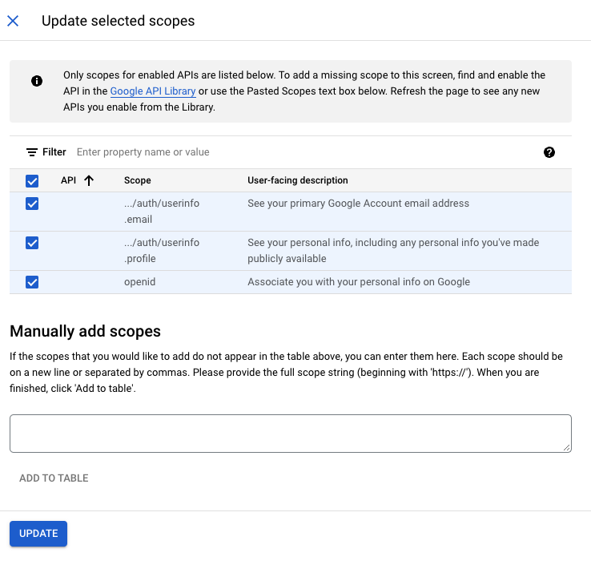

## Authjs Config

For google auth credential go to

https://console.cloud.google.com/

Click on

After, you need to create to create a new porject

In this page

Inside OAuth consent screen chose this and after create it

Then you can choose for the moment for app domain your local host server ...

And for authorized domains, you can come back to this when you have a domain to host the app, if you already have one.

Save and continue...

Then, click on add or remove scope and choose this 3 scopes, and update

Go on, save and continue!

For OAuth with Next.js and the Google provider, the test users section of the OAuth consent screen is not strictly essential for your application to function in production. However, it is very important during the development and testing phase. Here's why:

Development phase: Google uses the list of test users to limit who can connect to your application until it has been verified. This allows you to test OAuth authentication without exposing your application to unauthorized users.

Security and compliance: This helps prevent misuse of your OAuth credentials by unapproved users before your application is fully secure and compliant with Google's requirements.

How does it work? After adding e-mail addresses as testers, only these addresses will be able to connect via Google OAuth to your application. This is useful for testing authentication and authorization flow in a controlled environment. Once you go live and your application is verified, you no longer need to specify test users.

In short, setting up test users is a crucial step in the secure development of your application. It allows you to test OAuth integration without compromising security or exposing the application to a wide audience before it's ready.

---

For the next step go to Credentials and click on CREATE CREDENTIALS and OAuth client ID

Then

It is very important to respect this field

`http://localhost:3000/api/auth/callback/google`

...**When** the app is in porduction, just replace the localhost with the domain name

Then You gonna find this one

